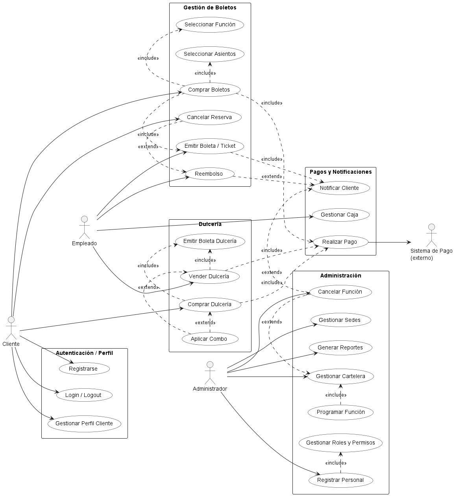

# 🎬 Sistema Cineplanet

Este proyecto es una aplicación web para la gestión integral de las sedes de Cineplanet.

## 📊 Diagramas de casos de uso
Los casos de uso clave están representados haciendo uso de PlantUML.

## 📈 Diagramas de secuencia

Los diagramas de secuencia están representados haciendo uso de Mermaid.

- [Compra de boletos](Diagramas/compra-boletos.mmd)
- [Compra en dulcería](Diagramas/compra-dulceria.mmd)
- [Registro y Login](Diagramas/registro-login.mmd)
- [Cancelación de función](Diagramas/cancelar-reserva.mmd)
- [Gestión de cartelera](Diagramas/gestion-cartelera.mmd)
